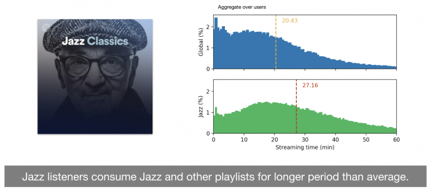
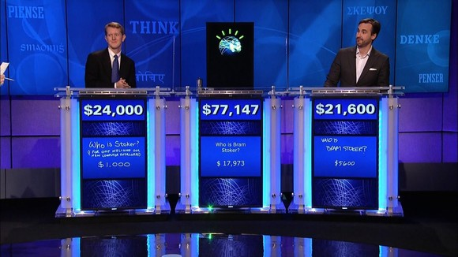
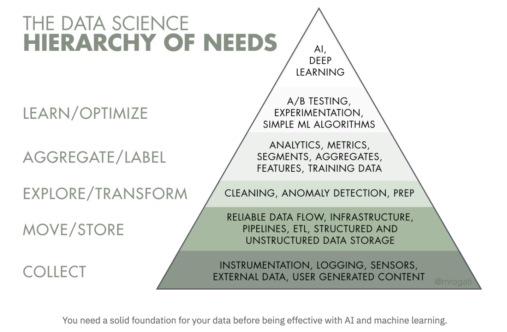

# Introducción a la Inteligencia Artificial (parte práctica)

5to año - Ingeniería en Sistemas de Información

Facultad Regional Villa María

## Cuestiones administrativas de la parte práctica:

### Organización de las clases prácticas

* Cada clase práctica tomará como referencia clases teóricas anteriores, mostrando un enfoque práctico de la misma (por ejemplo, explicando cómo se implementa computacionalmente un algoritmo visto en el teórico de la materia).

* Tras la clase práctica se dejará tiempo para avanzar en los ejercicios (a partir de la próxima clase vamos a empezar a trabajar con Python).

* Github de la cátedra: https://github.com/inteligenciafrvm/inteligenciafrvm

* [Acceso desde Campus Virtual](https://cvirtual.frvm.utn.edu.ar/course/view.php?id=253)

* Invitación al Discord (ver en el campus).

### Trabajos prácticos

Cada práctico requiere implementación de código y/o comentarios sobre algunas preguntas o desarrollos, pudiendo también tener ejercicios opcionales.

* 3 trabajos prácticos (individuales): aprendizaje supervisado, redes neuronales y aprendizaje por refuerzos. 
	* Para hacerlos se permite utilizar código existente (ej: provistos en el notebook de la clase, Stack Overflow, etc.), librerías, artículos, libros, blogs, etc. 
	* En cada TP, deben citarse las fuentes y aclarar qué partes han sido implementados por otras fuentes. 
	* Importante: no incluir código hecho por otro estudiante.

* Los prácticos son entregados a través de la plataforma Classroom de Github (requiere cuenta de Github). El Classroom de IA 2021 es [este](https://classroom.github.com/classrooms/36535598-inteligenciafrvm-clase-2021).

* Criterio (general) de calificación:
    * Cumplimiento de las consignas.
    * Grado de elaboración de las consignas.
    * Solidez en los conceptos/técnicas aplicadas.
    * En aquellas consignas/prácticos que incluyen elección de un problema (ej. de un conjunto de datos en el TP1), se valora la complejidad del problema elegido para resolver.
    * Originalidad. Se valora positivamente el tomar enfoques extras de los vistos en clase, buscarle nuevas vueltas. Se valora negativamente usar porciones de código o elaboraciones de texto de otros compañeros (colusión), si se detecta esto se aplica desde descuento de puntos hasta la anulación total del práctico.
    * Por último, se valora positivamente en cada práctico el esfuerzo invertido (mostrando ej. hipótesis de intentos realizados y que no dieron frutos), la claridad en la redacción y presentación, y la resolución de ejercicios opcionales, así como la ayuda brindada a sus compañeros en Discord y la participación en las clases prácticas.

### Regularización

El cursado de la materia se aprueba tras aprobar (calificación 6-10) todos los trabajos prácticos. En el caso de no aprobar alguno de ellos, se prevé una instancia de reentrega.

### Examen final práctico

* Presentación individual de uno de los siguientes prácticos (puede ser con diapositivas, paso a paso del notebook, o como mejor lo consideren), corrigiendo los errores señalados en el cursado. Los prácticos a elegir para presentar son:

    - TP1
    - TP2 (incluyendo resolución del notebook de redes convolucionales) o
    - TP3 (incluyendo resolución del notebook de aprendizaje por refuerzos profundo).

  Se evaluará en el examen tanto la correcta implementación y entendimiento de los mismos, como la comprensión del problema que la implementación resuelve.

### Objetivos principales del práctico de la materia

* Comprender cómo las distintas tecnologías ofrecen formas de implementar los algoritmos y modelos vistos en las clases teóricas.

* Comprender con la práctica el funcionamiento de las distintas técnicas de IA.

* Aprender a desarrollar prototipos de sistemas inteligentes.

* Entender, desde un punto de vista práctico, cómo utilizar la IA para darle un **agregado de valor** a los sistemas de información.

* Dada la cantidad de técnicas de IA disponibles, es imposible poder cubrirlas a fondo a todas en un curso.

* Es por eso que la visión de esta materia pretende mostrar una **visión general**: se centra en mostrar cómo las técnicas más importantes se usan para resolver problemas relevantes en la actualidad.

* Si bien la IA es un campo muy cambiante, ciertas sub-áreas se han mantenido con bases similares por muchos años. Es por eso que al comprender los fundamentos básicos es posible luego aprender técnicas nuevas conforme vayan necesitando aplicar en su vida profesional.

Por último:

* Las clases y trabajos prácticos van a estar enfocados en Python y es muy recomendable que los ejercicios sean realizados en dicho lenguaje (varios de los ejercicios involucran ampliar código existente).

* No obstante, se permite utilizar cualquier lenguaje a elección (en tal caso, tener en cuenta que muchos lenguajes no tienen un ecosistema amplio de librerías de IA). Algunas alternativas: R u Octave).

***

## Introducción a la Inteligencia Artificial (enfoque práctico)

### Repaso: definición / perspectiva de la IA (Russel y Norvig, 2010)

* Pensar ("caja blanca")
    * Como humanos: Enfoque cognitivo, neurocientífico, psicológico.
    * Racionalmente: Razonamiento lógico, deducciones a través de su conocimiento.


* Actuar ("caja negra")
    * Como humanos: Test de Turing.
    * Racionalmente: Agente racional, actúa buscando el mejor resultado.


* Estas perspectivas no son simplemente formas de definir la IA, sino que marcan una separación entre distintas posturas en las comunidades científicas.
	* Ejemplo claro de postura: [The Bitter Lesson](http://www.incompleteideas.net/IncIdeas/BitterLesson.html), de Richard Sutton. 

### Repaso: inteligencia artificial general (AGI) (Russel y Norvig, 2010)

* IA universal capaz de aprender y actuar en cualquier ambiente.


* Llegar a la AGI es el **Pináculo de la IA**. También referido como "Strong AI" (computadora con una mente, capaz de entender, imposible que exista según filósofos como [Searle](https://es.wikipedia.org/wiki/Habitaci%C3%B3n_china)).

Hasta ahora, la única formalización teórica-matemática sobre la misma es [AIXI](https://en.wikipedia.org/wiki/AIXI), propuesta por Marcus Hutter, Jürgen Schmidhuber y Shane Legg.

### Estado actual de la IA:

* ¿"Verano de la IA"? grandes recursos computacionales + grandes datasets + grandes algoritmos.


* Grandes avances en procesamiento de imágenes, audio, video y texto.


* Aplicaciones impresionantes en robótica y juegos.


* Integración de IA en industrias y áreas de investigación no necesariamente relacionadas con computación.


* Enfoque *bottom-up* (inductivo, a partir de los datos "crudos") de la IA actualmente se impone frente al enfoque *top-down* (deductivo, a partir de modelos cognitivos o del razonamiento lógico).


* Dominio del aprendizaje automático (*machine learning (ML)*), auge del **deep learning** (DL).

Ejemplo 1: Reconocimiento de imágenes


(crédito: https://www.cs.toronto.edu/~fritz/absps/imagenet.pdf)

Ejemplo 2: Decodificación de videos

https://youtu.be/nsjDnYxJ0bo

https://www.youtube.com/watch?v=Qh5_uMGXl1g

(crédito: http://www.purdue.edu/newsroom/releases/2017/Q4/researchers-demonstrate-mind-reading-brain-decoding-tech-----.html)

Ejemplo 3: Generación de imágenes "reales"!!!


(crédito:  Nguyen et al. 2016 - Plug & play generative networks:  Conditional iterative generation of images
in latent space - https://arxiv.org/abs/1612.00005)

[También de personas hablando en un video!](https://www.youtube.com/watch?v=p1b5aiTrGzY&feature=youtu.be)

(crédito: [Paper de 2019 de Samsung AI: Few-Shot Adversarial Learning of Realistic Neural Talking Head Models](https://www.profillic.com/paper/arxiv:1905.08233))

Ejemplo 4: Transferencia de imágenes de un contexto a otro


(crédito: Choi et. al. 2017 - StarGAN: Unified Generative Adversarial Networks for Multi-Domain Image-to-Image Translation - https://arxiv.org/abs/1711.09020)

Ejemplo 5: Robocup


(crédito: https://cosmosmagazine.com/technology/robocup-2017-wrap-up-highs-lows-plenty-of-falls)

Ejemplo 6: Self-driving cars


Fuente: https://www.greencarreports.com/news/1112829_tesla-is-designing-its-own-computer-chip-for-self-driving-cars-report#

Ejemplo 7: Recomendaciones personalizadas y reconocimiento de patrones ocultos



Fuente: https://research.atspotify.com/deriving-user-and-content-specific-rewards-for-contextual-bandits/

Ejemplo 8: Reconocimiento de lenguaje natural, juegos



Fuente: https://www.infoworld.com/article/2993255/analytics/ibms-watson-won-jeopardy-now-it-needs-to-win-the-world.html

...juegos...  https://deepmind.com/research/alphago/


... más https://blog.openai.com/openai-five/


... y más juegos!


### Estado actual de la IA: algunos desafíos (funcionales)

El enfoque funcional adoptado para llevar a cabo inducciones presenta varios desafíos

* Tendencia a usar modelos de caja negra, poco interpretables.


* Sensibilidad a la distribución del dominio / datos con los que fueron entrenaron los modelos.


* Ajuste de híper-parámetros.


* ¿Cómo integrar conocimiento de dominio?

Ejemplo 1:

http://www.labsix.org/media/2017/10/31/video.mp4

(crédito: http://www.labsix.org/physical-objects-that-fool-neural-nets/)

Ejemplo 2


(crédito: https://karpathy.github.io/2012/10/22/state-of-computer-vision/)

### Estado actual de la IA: algunos desafíos (ingenieriles)

Se requiere **mucho esfuerzo para preparar los datos** y que puedan servir como entradas en modelos de IA. Buena lectura: https://www.oreilly.com/radar/the-unreasonable-importance-of-data-preparation/. ¿Y los datos del Coronavirus? [Buena lectura sobre dificultad con estos datos](https://fivethirtyeight.com/features/why-its-so-freaking-hard-to-make-a-good-covid-19-model/).


Fuente: https://www.oreilly.com/radar/the-unreasonable-importance-of-data-preparation/

***

### Estado actual de la IA: algunos desafíos (éticos)

#### Varias posturas populares con respecto al estado actual y futuro de la IA


##### Actualidad:

* **IA promisoria** como herramienta fundamental en nuestras vidas
    * La posibilidad de replicar capacidades humanas abre las puertas a posibilidades sin precedentes.
    * Gran capacidad de resolver problemas mediante automatización.
    * Capacidad de obtener información muy valiosa en los enormes volúmenes de datos que generamos.
    * Capacidad de detectar tempranamente problemas como los de salud y asociaciones/patrones ocultos.

vs.

* **Miedo** de las capacidades de la IA
    * Capacidad de quitarnos trabajos y de empeorar la distribución global de la riqueza.
    * Modelos replican sesgos en la sociedad (racismo, xenofobia, discriminación, etc.) y permite manipulación de los mismos.
    * La falta de comprensión sobre los modelos con impacto real en nuestras vidas puede generar consecuencias que llegan desde accidentes hasta catástrofes naturales.
    * El usuario no tiene un acceso transparente de cómo y para qué se usan sus datos (en ocasiones directamente no puede ver ni qué tipo de datos recolectan de él) que sirven para entrenar modelos, ni qué información se infiere en base a los mismos > Muchas aplicaciones se aprovechan de esto para extraer información sin consentimiento. Ejemplo: recordar lo que pasó con Cambridge Analytica. Película sobre esto: The Social Dilemma (en Netflix).


> But as Cathy O’Neil reveals in this urgent and necessary book, the opposite is true. The models being used today are **opaque**, **unregulated**, and **uncontestable**, even when they’re wrong.
Most troubling, they reinforce discrimination: If a poor student can’t get a loan because a lending model deems him too risky (by virtue of his zip code), he’s then cut off from the kind of education that could pull him out of poverty, and a vicious spiral ensues. Models are propping up the lucky and punishing the downtrodden, creating a “toxic cocktail for democracy.” Welcome to the dark side of Big Data.
Tracing the arc of a person’s life, O’Neil exposes the black box models that shape our future, both as individuals and as a society. These “weapons of math destruction” score teachers and students, sort résumés, grant (or deny) loans, evaluate workers, target voters, set parole, and monitor our health.

Algunas lecturas:
* [Muy interesante debate (en reddit): Everyone building machine learning products has a responsibility to understand that many users have misconceptions about the accuracy and 'objectivity' of ML](https://old.reddit.com/r/MachineLearning/comments/bhm0si/d_everyone_building_machine_learning_products_has/)
* [Artículo: Do algorithms reveal sexual orientation or just expose our stereotypes?](https://medium.com/@blaisea/do-algorithms-reveal-sexual-orientation-or-just-expose-our-stereotypes-d998fafdf477)
* [Artículo: Artificial Intelligence’s White Guy Problem](https://www.nytimes.com/2016/06/26/opinion/sunday/artificial-intelligences-white-guy-problem.html?_r=1)
* [Artículo: Data science instrumenting social media for advertising is responsible for todays politics](http://gael-varoquaux.info/programming/data-science-instrumenting-social-media-for-advertising-is-responsible-for-todays-politics.html)
* [How Cambridge Analytica turned Facebook ‘likes’ into a lucrative political tool](https://www.theguardian.com/technology/2018/mar/17/facebook-cambridge-analytica-kogan-data-algorithm?CMP=share_btn_tw) [(artículo principal del Data Breach de Facebook)](https://www.theguardian.com/news/2018/mar/17/cambridge-analytica-facebook-influence-us-election)


##### A futuro:

* Estamos a muchos, muchos años de resolver la Inteligencia Artificial General (AGI). Ejemplo: https://www.nytimes.com/2017/07/29/opinion/sunday/artificial-intelligence-is-stuck-heres-how-to-move-it-forward.html


vs.

* IA cada vez más crucial en nuestras vidas, necesidad de regularla y tomar cartas en el asunto. Fuente: [Erdélyi y Goldsmith - Regulating Artificial Intelligence: Proposal for a Global Solution. AAAI 2018](http://www.aies-conference.com/wp-content/papers/main/AIES_2018_paper_13.pdf)


* "Carrera en la IA" (estilo "carrera espacial") para el avance estratégico: retórica y riesgos. Fuente: [Cave y Heigeartaigh - An AI Race for Strategic Advantage: Rhetoric and Risks. AAAI 2018](http://www.aies-conference.com/wp-content/papers/main/AIES_2018_paper_163.pdf)
    * Riesgos de que solamente exista una retórica: obstaculiza el debate y puede incitar a una carrera.
    * Riesgos de que existan tanto una retórica como una carrera: riesgos de no tomar medidas de seguridad adecuadas y riesgos de un conflicto entre grupos o hasta países.
    * Riesgos de que exista una carrera, sin retórica: concentración de poder y posibilidad de abusos y conflictos.

 ¿Qué hacer entonces? (según los autores)
 * Como sociedad: "IA para todos" - democratizar el poder de la IA y sus beneficios. Datos abiertos y algoritmos transparentes. Así, no importará quién "gana" la carrera.
 * Como profesionales: **distribuir el conocimiento de la IA**; promover narrativas positivas en la sociedad y en los políticos.

vs.

* Se viene Skynet? (sensacionalismo) Ejemplo: https://www.entrepreneur.com/article/298005. Debate reciente sobre esto: https://old.reddit.com/r/MachineLearning/comments/b0rdsi/d_irresponsible_anthropomorphism_is_killing_ai/?st=jt8tr18y&sh=1e91a65b

En la actualidad, al menos dos empresas apuntan a la AGI (asumiendo a la misma como posible): DeepMind y OpenAI

   * Postura de OpenAI al decidir (y dejar públicamente sentada su decisión) de no publicar un modelo entrenado de procesamiento de texto, y subsecuentes debates https://www.skynettoday.com/briefs/gpt2, https://old.reddit.com/r/MachineLearning/comments/arpysz/d_openai_not_releasing_fully_trained_model_is_it/

   * [Interesante artículo sobre OpenAI en este aspecto](https://www.technologyreview.com/s/615181/ai-openai-moonshot-elon-musk-sam-altman-greg-brockman-messy-secretive-reality/) y [su correspondiente discusión en reddit](https://old.reddit.com/r/MachineLearning/comments/f5immz/d_the_messy_secretive_reality_behind_openais_bid/)


***


### Estado actual de la IA: oportunidad de gran aporte para el beneficio social

Dos beneficios principales de la explosión de IA/ML desde 2012:

* Potenció muchos métodos que se investigaban hace décadas: desde sencillos métodos estadísticos hasta redes neuronales.
* Aportó nuevas formas de realizar generalizaciones **sin tener que diseñar features a mano**.

Esto permitió el surgimiento de aplicaciones de todo tipo, entre las cuáles se encuentran algunas con capacidad de tener un impacto social muy positivo. Algunos ejemplos:

* Detección temprana de enfermedades.
* Mejores usos en agricultura.
* Predicciones de fenómenos climáticos, cambio climático.
* Redistribución de la riqueza.

***

### Estado actual de la IA: Área muy demandada en la industria \*:

Hay cuatro trabajos principales como profesionales

* Data engineer
* Data scientist
* Research engineer
* Research scientist

(\* estos roles, como surgieron hace pocos años, no están marcados en piedra y pueden ser más difusos/tener distinto significado según cada empresa, equipo, y volumen de información manejado)

***

### Actividades

Para la clase que viene, elaborar [este](https://docs.google.com/document/d/1tLcv3In1SFDRIJH9mJ5nkmK2sJ8gFRJVjMqxr9ZZ1Ro/edit) documento colaborativo, respondiendo a las siguientes preguntas:

1\. Considerar una IA en la ciencia ficción o cultura popular (ejemplo: Terminator). Para cada una de ellas, responder:
1. ¿Con qué capacidades cuenta?
2. ¿Cuáles de dichas capacidades todavía no está disponible en la vida real?
3. ¿Es esa IA consciente de sí misma?
4. ¿Cuál(es) de las definiciones de IA satisface la misma? Reflexionar por qué satisface cada una de las definiciones indicadas. (según la categorización en los cuadrantes, ver capítulo 1 de libro de Russell y Norvig para más información)
5. ¿Puede considerarse como una Inteligencia Artificial General (AGI)?

2\. Buscar una IA real relevante en los últimos años. Puede ser desde una pequeña app hasta una IA que haya marcado un hito, por ejemplo:

* IBM Watson, IA ganadora en Jeopardy ([artículo de ejemplo](https://www.elperiodico.com/es/tecnologia/20110217/un-ordenador-de-ibm-gana-el-concurso-de-preguntas-y-respuestas-jeopardy-825011)).
* AlphaGo, IA ganadora en Go frente a campeón surcoreano Lee Sedong ([artículo de ejemplo](https://peru.com/epic/tecnologia/alphago-inteligencia-artificial-google-vence-campeon-go-noticia-444660)).
* OpenAI Five.

Para la IA elegida, responder:

1. ¿Cuál es su principal punto fuerte con respecto a las capacidades humanas?
2. ¿Qué definiciones de IA satisface o intenta satisfacer? Justificar brevemente.
3. Según tu criterio, ¿qué necesitaría para satisfacer aquellas definiciones de IA que no está cumpliendo?


#### Adicionalmente...

Instalar Anaconda (versión 3, preferentemente) y (opcionalmente) algún IDE de Python (ej: [Pycharm](https://www.jetbrains.com/pycharm/)). Para ello:

- Descargar la plataforma para DataScience "Anaconda" desde

	https://docs.anaconda.com/anaconda/install/

	Se deberá seleccionar la versión del intérprete Python (recomendada: python 3.7 (o mayor)).


- Seguir las intrucciones de instalación de Anaconda según el sistema operativo.

También pueden implementarse algoritmos online, utilizando la plataforma de [Google Colaboratory](https://colab.research.google.com/).

- Instalar Git (si no lo tienen ya instalado) desde https://git-scm.com/downloads y un cliente, por ejemplo https://gitextensions.github.io/ (otras opciones en https://git-scm.com/downloads/guis).

Algunos eventos de AI de 2021:

* [Escuela de Ciencias Informáticas 2021 (Virtual)](https://eci2021.dc.uba.ar/). [Cursos de IA para 2021](https://eci2021.dc.uba.ar/cursos-eci/). Cursos de este año en el track inteligencia artificial:
    * Sistemas Argumentativos en Razonamiento Computacional.
    * From explainable machine learning to causality.
    * Aprendizaje automático con datos escasos.

A observar dependiendo si vuelven o no las reuniones presenciales este año

* [PyData Córdoba 2021](). Encuentro con charlas sobre casos de estudio aplicados en ML/data science.
* [Khipu - Latin American Meeting In Artificial Intelligence](https://khipu.ai). Encuentro latinoamericano de IA con talleres, charlas y eventos varios.
* [Reunión Internacional de Inteligencia Artificial (RIIA)](https://www.riiaa.org/). Encuentro latinoamericano de IA, que tiene lugar todos los años en México.
* Internships!

Estos eventos cuentan con programas de becas para estudiantes.

Extra: 


#### Algunos links por si les interesa conocer más allá del alcance de la materia

* [Reddit de Machine Learning](https://www.reddit.com/r/MachineLearning/).

* [Resumen del estado del arte de Deep Learning, Enero 2020](https://lexfridman.com/files/slides/2020_01_06_deep_learning_state_of_the_art.pdf)

* [Curso introductorio a Machine Learning de Andrew Ng](https://www.coursera.org/learn/machine-learning).

* [Curso de Redes Neuronales Convolucionales para Reconocimiento Visual - Universidad de Stanford, 2016](https://www.youtube.com/watch?v=NfnWJUyUJYU&list=PLkt2uSq6rBVctENoVBg1TpCC7OQi31AlC).


```python

```
